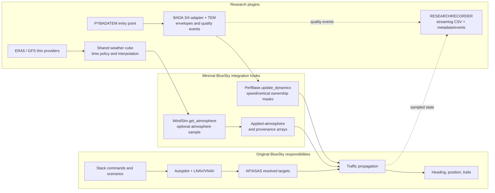
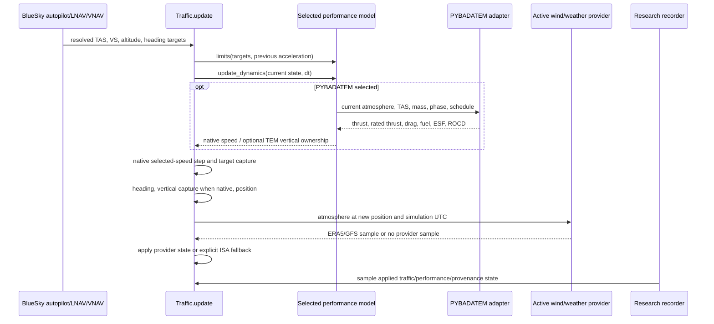
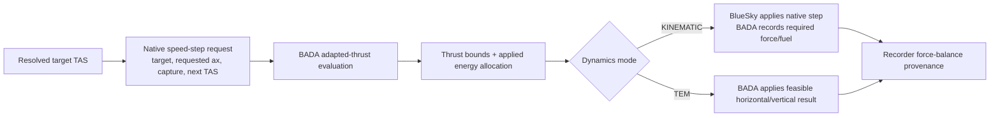
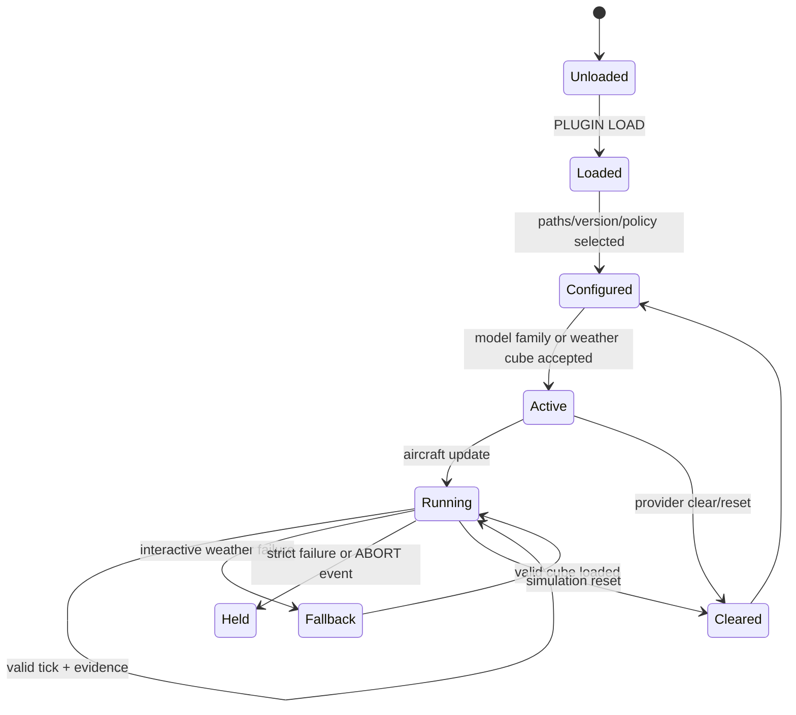

# Current research-plugin architecture

## Purpose and status

This is the current-code map for PYBADATEM, ERA5, GFS, and
RESEARCHRECORDER. It distinguishes original BlueSky responsibilities, the
minimal coexisting hooks added to BlueSky, and plugin-owned behavior. Current
validation status and claim boundaries are maintained in
[`reproducibility-matrix.md`](reproducibility-matrix.md).

The dependency-free, licensed BADA, weather/TEM, schema-compatibility, and
plugin-disabled gates are closed for the scope recorded in the matrix. Tests
requiring licensed BADA data or external weather resources remain separately
marked and require a validated local run manifest.

## Component map

The hooks are inert when the plugins are not selected. The closed disabled
plugin baseline produced byte-identical final-state JSON against the tested
upstream revision.

## Per-tick logic today

### Horizontal-energy implementation status

Historically the speed request was calculated after `update_dynamics`, so
PYBADATEM could report level-flight `thrust = drag` while BlueSky changed TAS.
The current implementation now calculates a typed `SpeedStepRequest` before
the performance hook and uses it for both PYBADATEM evaluation and native
propagation.

For level flight, BADA 3 uses public `TAdapted`; BADA 4 uses the equivalent
required-thrust equation and CT-based fuel evaluation. Required, idle, and
maximum thrust plus requested/applied acceleration and limitation state are
retained per aircraft. Strict mode rejects a request outside the thrust bounds
by holding the simulation without terminating BlueSky.
The adapter now implements thrust-feasible horizontal saturation and one joint
horizontal/vertical energy allocation in TEM mode:

## Plugin state and ownership

| Area | Original BlueSky owns | Plugin owns | Current state |
| --- | --- | --- | --- |
| Navigation | SPD, LNAV/VNAV, waypoint and turn targets | Nothing | Preserved |
| Horizontal propagation | Native target selection and capture | Adapted thrust/fuel and feasibility | Saturation and joint horizontal/vertical allocation implemented and scoped by licensed gates |
| Vertical propagation | Native VS/altitude capture | PYBADATEM owns VS in TEM mode | Implemented and envelope-checked |
| Performance | Replaceable performance selection | BADA 3/4 resolution, force/fuel/mass, strict failures | Implemented; steady cruise defensible |
| Envelopes | No research policy | Per-aircraft OFF/REPORT/ENFORCE/ABORT | BADA 3.15 and 4.2 scoped validation closed |
| Atmosphere | ISA initialization and airdata | ERA5/GFS temperature, pressure, density, wind and provenance | Implemented and validated |
| Weather time | Simulation UTC | Exact provider slots and opt-in interpolation | ERA5 hourly; GFS six-hourly |
| Invalid weather | ISA remains available | Strict abort or explicit interactive ISA fallback | Implemented; no extrapolation |
| Evidence | Simulation state | Versioned streaming CSV, metadata, quality events | `samples-v10`, bounded memory |

## Lifecycle map

PYBADATEM resolves aircraft before Traffic arrays are resized, maintains
per-aircraft model/envelope state through create/delete/reset, and switches BADA
families transactionally. Meteorology accepts a cube only after schema and
content validation; failed or expired time slots never retain stale weather.
The recorder streams rows and closes authoritative CSV, metadata, and event
evidence on stop/reset or an ABORT event.

## Current claim boundary

Safe claims include exact tested weather-slot behavior, bounded spatial and
vertical interpolation, explicit fallback provenance, BADA resolution and
envelope behavior, route/speed target capture, and constant-speed level-flight
`thrust = drag`.

Level-flight adapted-thrust force balance and joint horizontal/vertical energy
allocation are covered by packaged and licensed BADA 3/4 gates in their
recorded scope. The clean operational matrix adds one BADA 4.2 A320-232 route
under enforced mass, CAS, altitude, ROC, and ROD checks. It is not evidence for
non-clean terminal configurations, phase-aware Mach limits, or the preserved
FL390 operational trajectory; those boundaries are recorded in
`research-modeling-open-issues.md`. Route geometry remains BlueSky guidance
evidence.

## Branch architecture

| Branch | Ownership |
| --- | --- |
| `plugin/recorder` | Streaming recorder and quality-event observation |
| `plugin/NWP-meteo` | ERA5/GFS providers, weather cubes, cache tools, and atmosphere hook |
| `plugin/pybada-tem` | PyBADA adapter, TEM dynamics, envelopes, and performance hooks |
| `integration/plugin-stack` | Reviewed composition of all three plugins |
| `research/reproducibility` | Scenarios, manifests, matrix runner, validators, and CI |

The matrix runner and validators are analysis code, not a fourth production
plugin. Shared host hooks remain inert when their plugin is not selected. The
composition is checked against the pinned plugin-disabled OpenAP/ISA baseline.

## Related documents

- `research-plugins.md`: operator-facing setup, commands, and validation.
- `bada-envelope-implementation.md`: envelope behavior and licensed scope.
- `reproducibility-matrix.md`: scenarios, comparison semantics, and validation.
- `research-modeling-open-issues.md`: deliberately unresolved questions.
