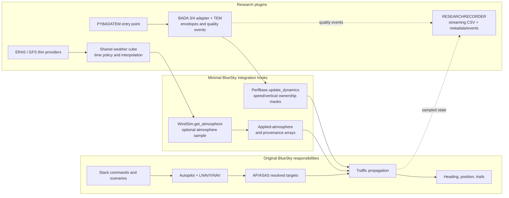
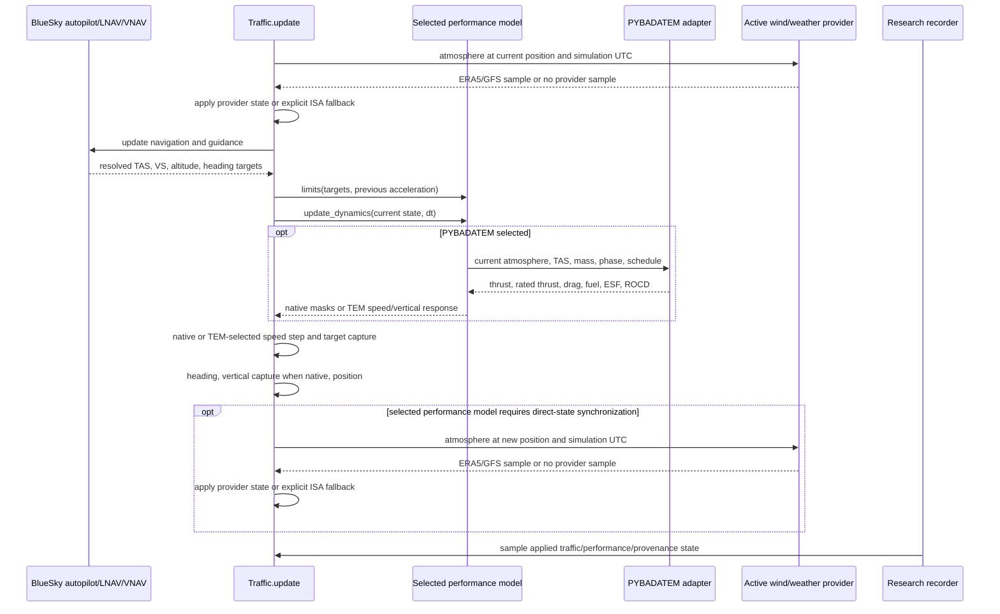
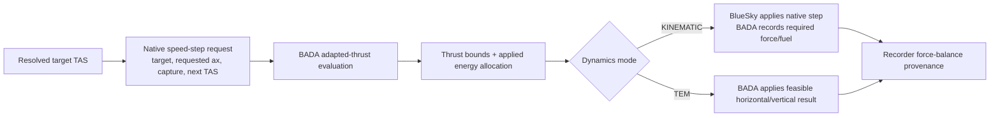
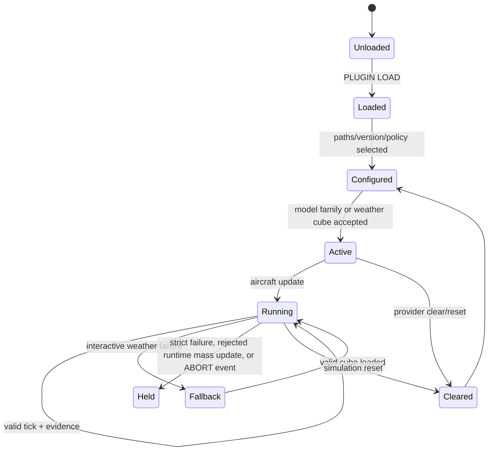

# Current research-plugin architecture

## Purpose and status

This is the current-code map for PYBADATEM, ERA5, GFS, and
RESEARCHRECORDER. It distinguishes original BlueSky responsibilities, the
minimal coexisting hooks added to BlueSky, and plugin-owned behaviour. The
validation protocol and claim boundaries are maintained in
[`reproducibility-matrix.md`](reproducibility-matrix.md).

Dependency-free checks, exact-v11 validation, licensed BADA gates,
weather/TEM gates, and a plugin-disabled comparison are implemented. Tests that
require licensed BADA data or external weather resources remain separately
marked and require a validated local run manifest. A gate's result is current
only for the exact commit and resources recorded with its retained evidence.

## Component map

The hooks are designed to remain inert when the plugins are not selected. The
repository provides an exact final-state comparison against a pinned upstream
revision; that gate must be rerun for the commit being assessed.

## Per-tick logic today

The first atmosphere update is unconditional and supplies the pressure,
temperature, density, wind, pressure altitude, and airdata used by guidance and
performance evaluation for the tick. After position propagation, models such
as PYBADATEM request a second synchronisation so their direct applied state and
the subsequently sampled traffic atmosphere describe the new position. Native
performance models do not request that second update.

### Horizontal-energy implementation status

Historically the speed request was calculated after `update_dynamics`, so
PYBADATEM could report level-flight `thrust = drag` while BlueSky changed TAS.
The current implementation now calculates a typed `SpeedStepRequest` before
the performance hook and uses it for both PYBADATEM evaluation and native
propagation.

For level flight, BADA 3 uses public `TAdapted`; BADA 4 uses the equivalent
required-thrust equation and CT-based fuel evaluation. Required, idle, and
maximum thrust plus requested/applied acceleration and limitation state are
retained per aircraft. In KINEMATIC mode, strict operation rejects an
adapter-reported infeasible horizontal thrust request by holding the simulation
without terminating BlueSky. In TEM mode, ordinary saturation does not by
itself hold a strict run: the adapter performs thrust-feasible speed-priority
allocation. It attempts the requested acceleration first, reduces the vertical
response towards level flight when necessary, and then clips acceleration to the
remaining thrust-feasible interval. Evaluation failures still hold a strict
run. Applied thrust drives both fuel flow and the recorded one-step response:

## Plugin state and ownership

| Area                   | Original BlueSky owns                     | Plugin owns                                                  | Current state                                                                                |
|------------------------|-------------------------------------------|--------------------------------------------------------------|----------------------------------------------------------------------------------------------|
| Navigation             | SPD, LNAV/VNAV, waypoint and turn targets | Nothing                                                      | Preserved                                                                                    |
| Horizontal propagation | Native target selection and capture       | Adapted thrust/fuel and feasibility                          | Saturation and joint horizontal/vertical allocation implemented; licensed gate available     |
| Vertical propagation   | Native VS/altitude capture                | PYBADATEM owns VS in TEM mode                                | Implemented and envelope-checked                                                             |
| Performance            | Replaceable performance selection         | BADA 3/4 resolution, force/fuel/mass, strict failures        | Implemented; dependency-free and licensed gates available                                    |
| Envelopes              | No research policy                        | Per-aircraft OFF/REPORT/ENFORCE/ABORT                        | Implemented; BADA 3/4 scenario-specific gates available                                      |
| Atmosphere             | ISA initialization and airdata            | ERA5/GFS temperature, pressure, density, wind and provenance | Implemented; synthetic and external-resource gates available                                 |
| Weather time           | Simulation UTC                            | Exact provider slots and opt-in interpolation                | ERA5 hourly; GFS six-hourly                                                                  |
| Invalid weather        | ISA remains available                     | Strict abort or explicit interactive ISA fallback            | Implemented; no extrapolation                                                                |
| Evidence               | Simulation state                          | Versioned streaming CSV, metadata, quality events            | `samples-v11`, bounded memory                                                                |

## Lifecycle map

PYBADATEM resolves aircraft before Traffic arrays are resized, maintains
per-aircraft model/envelope state through create/delete/reset, and switches BADA
families transactionally. Meteorology accepts a cube only after schema and
content validation; failed or expired time slots never retain stale weather.
The recorder streams rows and closes authoritative CSV, metadata, and event
evidence on stop/reset or an ABORT event.

HOLD cancels the remainder of propagation for a rejected tick, but it is not a
successful experiment-completion state. A strict failure may leave an active
recorder that must be stopped to finalise partial evidence. An ABORT quality
event is different: the recorder synchronously samples the triggering state and
closes its CSV, event stream, and metadata before the simulation is held. Both
remain partial runs unless the validator explicitly expects that failure mode.

## Validation boundary

The available gates can establish exact weather-slot behaviour, bounded spatial
and vertical interpolation, fallback provenance, BADA resolution and envelope
behaviour, route/speed target capture, constant-speed level-flight force balance,
and joint horizontal/vertical energy allocation. Those become claims only for
the scenario, commit, resources, aircraft, and timestep retained with a passing
validator result.

The implementation and its gates do not by themselves establish observed-flight
accuracy, arbitrary-aircraft coverage, generic non-clean terminal operation,
phase-aware Mach-limit selection, high-altitude feasibility, or equivalence
between different atmosphere and performance models. Route geometry remains a
BlueSky guidance result rather than independent trajectory truth. Durable open
questions are listed in `research-modeling-open-issues.md`.

## Branch architecture

| Branch                     | Ownership                                                                                                         |
|----------------------------|-------------------------------------------------------------------------------------------------------------------|
| `plugin/recorder`          | Streaming recorder and quality-event observation                                                                  |
| `plugin/NWP-meteo`         | ERA5/GFS providers, weather cubes, cache tools, and atmosphere hook                                               |
| `plugin/pybada-tem`        | PyBADA adapter, TEM dynamics, envelopes, and performance hooks                                                    |
| `integration/plugin-stack` | Reviewed composition, scenarios, manifests, matrix runner, validators, CI, and maintained technical documentation |

The matrix runner and validators are analysis code, not a fourth production
plugin. Shared host hooks remain inert when their plugin is not selected. The
provided comparison tool checks the composition against the pinned
plugin-disabled OpenAP/ISA baseline.

## Related documents

- `research-plugins.md`: operator-facing setup, commands, and validation.
- `recorder-v11-contract.md`: exact CSV, event, metadata, and export contract.
- `bada-envelope-implementation.md`: envelope behaviour and licensed scope.
- `reproducibility-matrix.md`: scenarios, comparison semantics, and validation.
- `research-modeling-open-issues.md`: deliberately unresolved questions.
